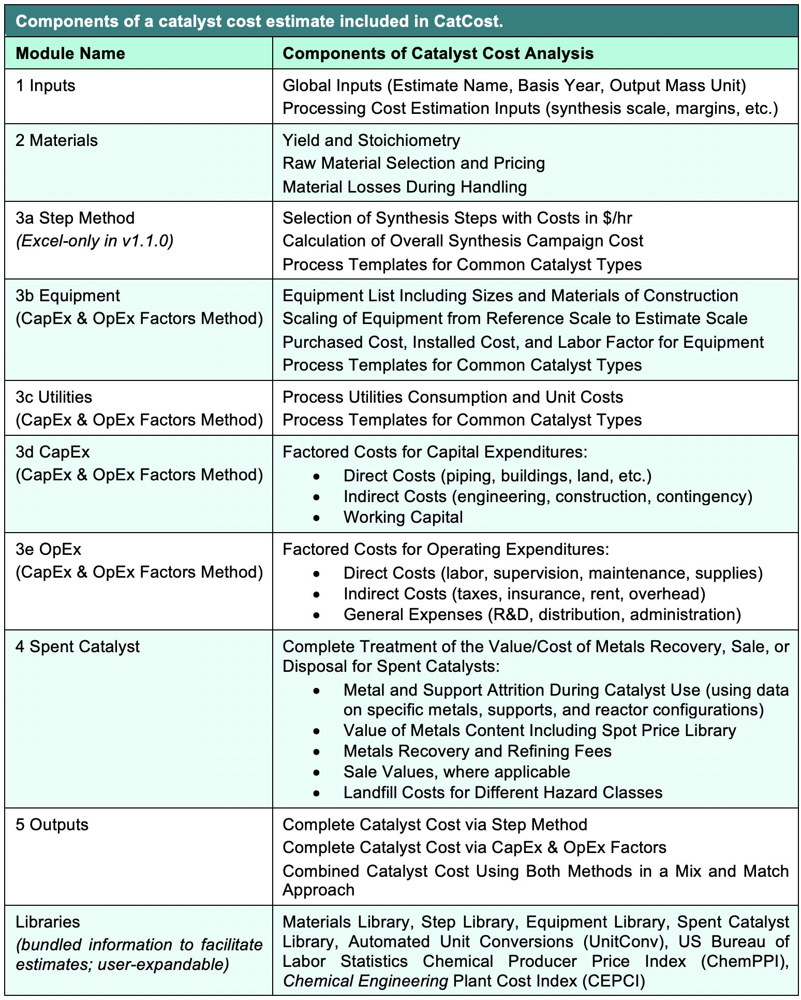

# Getting Started: Excel Spreadsheet

### Downloading

Download the latest CatCost Excel spreadsheet from https://catcost.chemcatbio.org/downloads. You can also access past versions at https://datahub.chemcatbio.org/project/catcost-spreadsheet.

### Creating an Estimate

In the Excel version of CatCost, **each file contains one estimate**. After downloading CatCost, we recommend making a new copy each time you want to start a new estimate. However, you may find it useful to customize the Excel spreadsheet with your own entries in the Materials, Equipment, and Spent Catalyst libraries, as well as by making changes to cost inputs such as the labor rate.

### Overview of Modules

In CatCost, a catalyst cost estimate is broken down into modules that are designed to be completed in order. In the spreadsheet version of CatCost, the modules are worksheets within the overall CatCost workbook.

TODO: image of modules

In CatCost, a catalyst cost estimate is broken down into modules that are designed to be completed in order. The first two modules are **1 Inputs**, for [global inputs](/estimation-methods/global-inputs) and **2 Materials**, for [raw materials](/estimation-methods/raw-materials). For processing costs (all of the non-materials components of catalyst cost, such as equipment and labor costs), CatCost contains two [distinct methods](/estimation-methods/two-processing-cost-methods); generally you would use only one of these methods in an estimate, although it is possible to complete both to [compare and combine them](/estimation-methods/two-processing-cost-methods). The [Step Method](/estimation-methods/step-method) uses module **3a Step Method** only. The [CapEx and OpEx Factors](/estimation-methods/capex-and-opex-factors) method uses modules **3b Equipment**, **3c Utilities**, **3d CapEx**, and **3d OpEx**. This concludes the estimation of purchase cost components, but it is critical for many catalysts to also consider the end-of-life value/cost of [spent catalyst](/estimation-methods/spent-catalyst), which is included in **4 Spent Catalyst**. Finally, the cost outputs can be viewed using **5a Summary Outputs**, **5b Detailed Outputs** _(web-only in v1.1.0)_, or **5c Printable Outputs** _(spreadsheet-only in v1.1.0)_ For more detail, see the table below.

### Inputs and Colors
### Global Inputs
### How much detail here????

<iframe width="560" height="315" src="https://www.youtube.com/embed/depIWmDr3L4" title="YouTube video player" frameborder="0" allow="accelerometer; autoplay; clipboard-write; encrypted-media; gyroscope; picture-in-picture" allowfullscreen></iframe>
